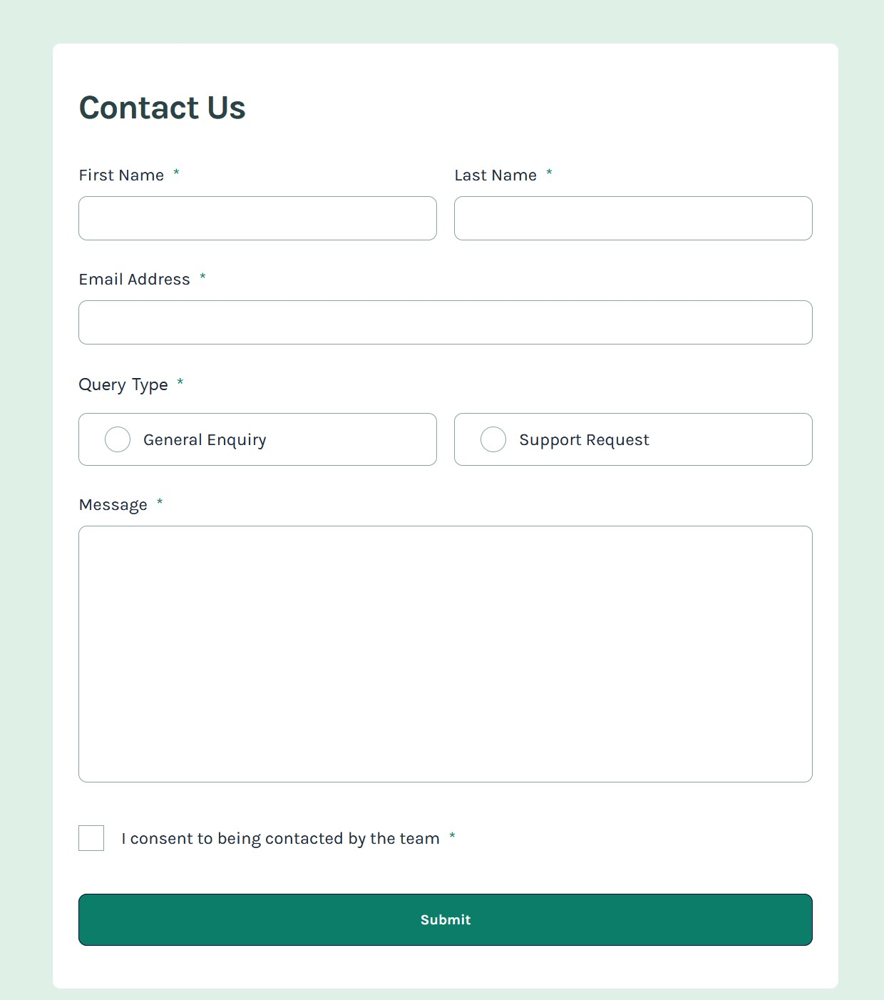

# Frontend Mentor - Contact form solution

This is a solution to the [Contact form challenge on Frontend Mentor](https://www.frontendmentor.io/challenges/contact-form--G-hYlqKJj). The project uses HTML, SCSS, and vanilla JavaScript to build a responsive contact form with inline validation and success feedback.

## Table of contents

- [Overview](#overview)
  - [The challenge](#the-challenge)
  - [Implemented behavior](#implemented-behavior)
  - [Links](#links)
- [Getting started](#getting-started)
  - [Available commands](#available-commands)
- [My process](#my-process)
  - [Built with](#built-with)
  - [What I learned](#what-i-learned)
  - [Testing](#testing)
  - [Continued development](#continued-development)
  - [AI collaboration](#ai-collaboration)
- [Author](#author)
- [Acknowledgments](#acknowledgments)

## Overview

### The challenge

Build a contact form that adapts to different screen sizes, provides clear validation feedback, supports keyboard interaction, and communicates errors and submission status to assistive technology.

### Implemented behavior

- Collect a first name, last name, email address, query type, message, and consent to be contacted.
- Reject empty or whitespace-only text fields and use the email input's native validity state to check email formatting.
- Require a query type and consent before showing success feedback.
- Keep error messages hidden until submission, then update each field's feedback as the user edits it.
- Associate errors with inputs through `aria-describedby` and update `aria-invalid` dynamically.
- Focus the first invalid control when validation fails.
- Reset the form and display a focused success notification when all fields pass validation.
- Dismiss the success notification when the user starts editing again.
- Provide visible keyboard focus indicators for custom radio and checkbox controls.

This is a client-side demo. Successful validation displays the notification locally; it does not send an email or submit data to a server.

### Links

- Repository: [jonghwascript/contact-form-main](https://github.com/jonghwascript/contact-form-main)
- Live Site URL: [Live site](https://jonghwascript.github.io/contact-form-main)
- Challenge: [Frontend Mentor contact form](https://www.frontendmentor.io/challenges/contact-form--G-hYlqKJj)
## Getting started

Install Node.js and npm, then run:

```sh
npm ci
npm run build
```

Open `dist/index.html` in a browser, or serve the `dist/` directory with a local static server. Edit files in `src/`; `dist/` contains generated output and is recreated by the build.

### Available commands

| Command | Description |
| --- | --- |
| `npm run build` | Recreate `dist/`, compile SCSS with source maps, process HTML, and copy JavaScript, images, and fonts. |
| `npm run dev` | Build the project and watch source files for changes. This command does not start a web server or reload the browser. |
| `npm test` | Run the contact form behavior tests with Node.js's built-in test runner. |
| `npm run format` | Format source HTML, SCSS, JavaScript, and the Gulp configuration with Prettier. |

## My process

### Screenshot



### Built with

- Semantic HTML form elements, including labels, a fieldset, and a legend
- SCSS modules, CSS custom properties, Flexbox, and fluid sizing with `clamp()`
- Reusable Stack, Cluster, Switcher, Cover, and Center layout utilities
- CSS `:has()` and `:focus-visible` for custom control states
- Vanilla JavaScript and the browser's constraint validation state
- Locally hosted Karla font files and SVG icons
- Gulp, Dart Sass, and Prettier
- Node.js's built-in test runner

### What I learned

**Validate radio buttons as a group.** A query type is valid when at least one radio button in the group is checked. Both options share the same `name` so that only one can be selected.

```js
valid = field.controls.some((radio) => radio.checked);
```

**Separate validation from error presentation.** The validation function determines whether a field is valid, while `showError()` synchronizes the message visibility and ARIA attributes. After the first submission attempt, input and change events keep feedback up to date.

```js
field.error.hidden = !invalid;
control.setAttribute('aria-invalid', String(invalid));
```

**Keep form semantics while styling custom controls.** Native radio and checkbox inputs remain available to keyboard users. Their surrounding labels and visual indicators reflect checked, invalid, and focused states through CSS selectors.

**Distinguish flex wrapping from text wrapping.** The consent label uses a non-wrapping flex container, a fixed-size checkbox indicator, and a flexible text element. This lets the text wrap beside the indicator instead of moving the entire text element onto a separate flex line.

### Testing

Run `npm test` to check:

- The neutral initial state, error visibility, and focus after an empty submission
- Whitespace-only input, invalid email state, missing query type, and missing consent
- Error recovery, form reset, success notification visibility, and subsequent submissions

The tests execute `main.js` against a small DOM fixture derived from the HTML. They supply the email validity state explicitly and do not verify the browser's email parser, rendered layout, or screen reader announcements. JavaScript syntax checks, SCSS compilation, and Gulp output generation were also checked during implementation.

### Continued development

- Add browser-based integration tests for keyboard submission, native email validation, and responsive layouts.
- Verify error descriptions and success feedback with screen readers.
- Review hover states and visual details against the challenge designs.
- For a production version, connect a submission endpoint, add server-side validation, and show success only after the server confirms receipt.

### AI collaboration

Codex assisted with code review, semantic naming, explanations of Flexbox and ARIA usage, form validation logic, regression tests, and documentation. Reviewing HTML and CSS together helped identify mismatched labels, outdated selectors, and notification visibility rules.

Automated event tests and build checks provided implementation feedback. Browser verification could not be completed because the browser tool failed to connect, so visual behavior and assistive technology support still need manual verification.

## Author

- GitHub: [@jonghwascript](https://github.com/jonghwascript)
- Frontend Mentor: [@jonghwascript](https://www.frontendmentor.io/profile/jonghwascript)

## Acknowledgments

Thanks to Frontend Mentor for the challenge design and assets. The reusable layout utilities are based on patterns from Every Layout.
